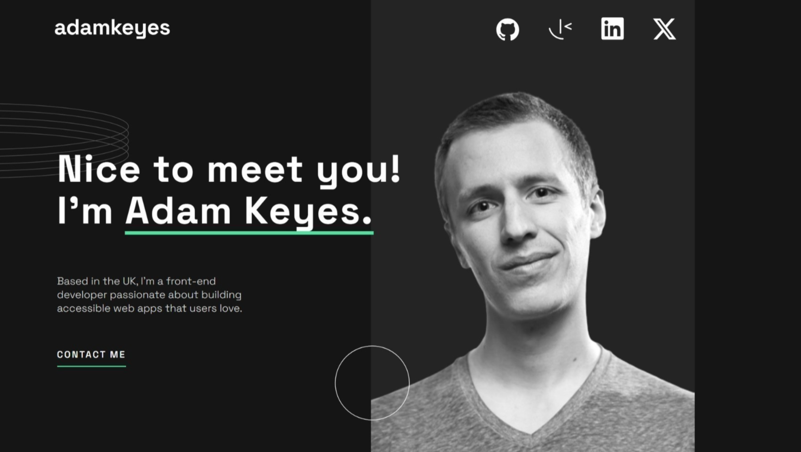
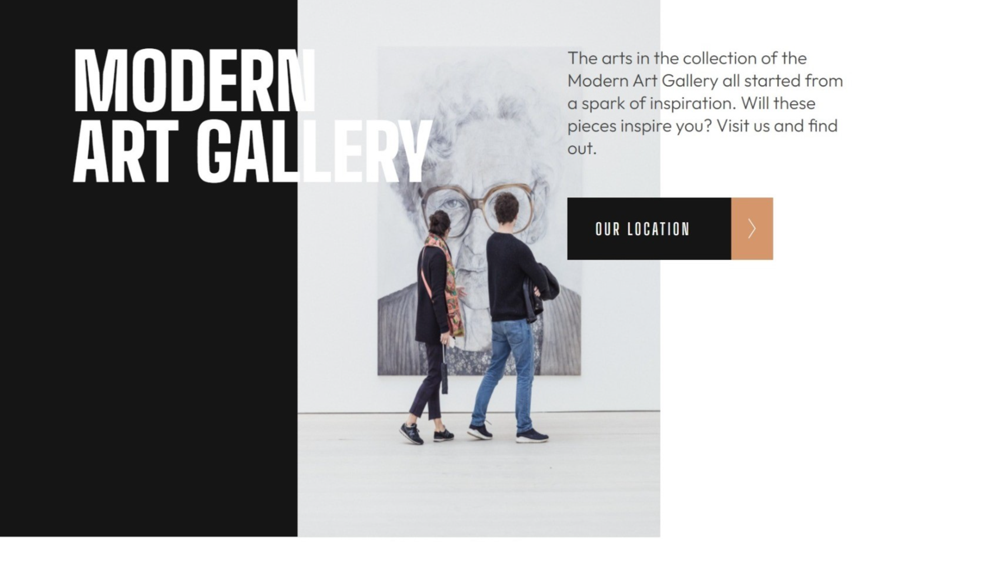
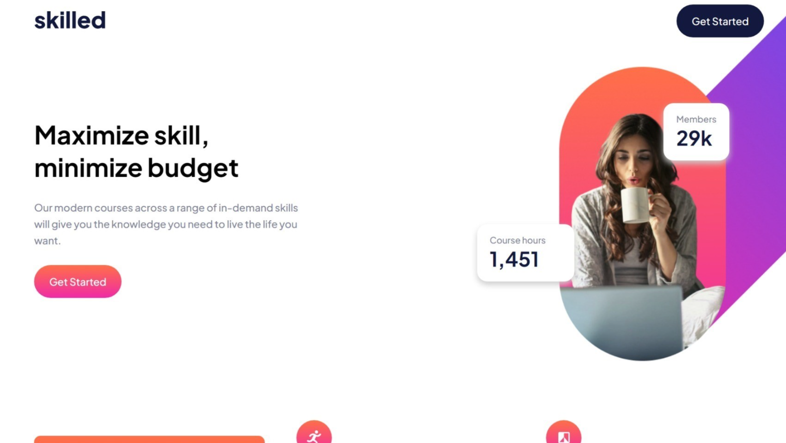
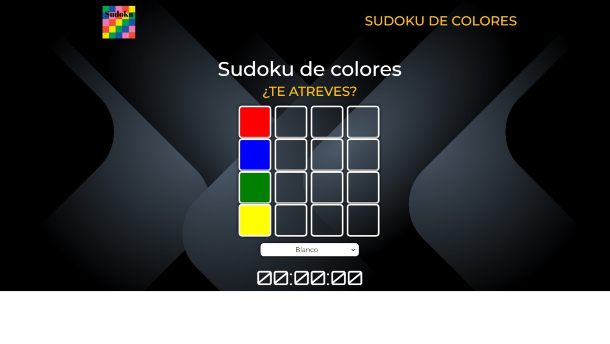
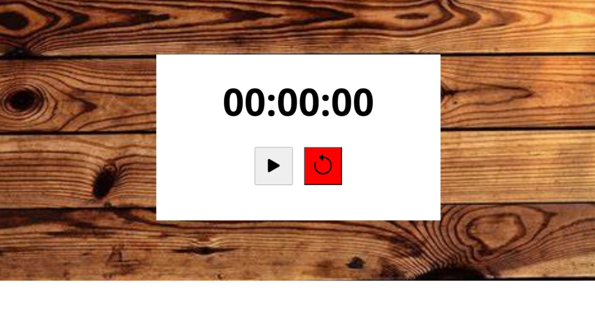

<h1 align="center"> Hola! Soy Esther,  Desarrollador Frontend | Frontend Development. </h1> 

<h2 align="center">Soy una apasionada maquetadora web, me encanta crear diseños atractivos y funcionales que mejoren la experiencia del usuario en la web.</h2>

 

 ## Sobre mí
 

    Soy una profesional creativa y comprometida en el diseño y desarrollo web. Me apasiona aprender nuevas tecnologías y tendencias para mantenerme actualizada en un mundo digital en constante evolución.
 

 
 - 👩‍🎓 Actualmente estudiando en **Academia ConquerX** en **Development Full Stack**.
 
 - 🤝 Estoy disponible para trabajar como Frontend Development.

 
 - 📫 Cómo contactar conmigo **estherchu13@hotmail.com**

  
## Tecnologías que manejo

 
 
 
 

## Projects ⚙️
<!-- <h1 align="center">Projects</h1> -->
<table bordercolor="#66b2b2">
  
  <tr>
    <td width="50%" valign="top">
      <h3 align="center">Header-Responsive-Coworking-Space</h3>
         
        
         
        

           
    
  
      

        
<strong>HTML5, CSS</strong> - Coworking-space: Pagina web responsive, optimizada para dispositivos moviles y diferentes tamaños de pantalla, incluyendo tabletas y escritorios. Incluye elementos como el logotipo de la marca, el menú de navegación, opciones de acceso y registro, y otras funcionalidades importantes para la navegación y la interacción con el sitio.

    </td>
    <td width="50%" valign="top">
      <h3 align="center">HTML-CSS-Microsite-Portofolio</h3>
         
      
         
        

    
   
  
      

        
<strong>HTML5, CSS, Sass</strong> - Microsite Portafolio :  Para un microsite de portafolio responsive. La plantilla está optimizada para dispositivos móviles y diferentes tamaños de pantalla, incluyendo tabletas y escritorios. Secciones organizadas para resaltar habilidades, proyectos, educación y experiencia laboral.

    </td>
  </tr>
  
  <tr>
    <td width="50%" valign="top">
      <h3 align="center">Landing-Pages-Responsive-Madern.Art.Gallery</h3>
       
        
       
        

           
  
  
      

        
<strong>HTML5, CSS, Sass</strong> - Modern-Art-Gallery: Un sitio web responsive para una galería de arte moderno. La página se adapta a tres tamaños de pantalla: móvil (414px), tablet (768px) y desktop (1200px), garantizando una experiencia visual óptima en cada dispositivo.

    </td>
    <td width="50%" valign="top">
      <h3 align="center">HTML-CSS-Responsive-Landing-Page</h3>
         
        
         
        

           
  
  
      

        
<strong>HTML5, CSS, Sass</strong> - Landing-Pages: Este proyecto presenta un ejemplo de una landing responsive desarrollado con HTML y Sass, diseñado para adaptarse de manera óptima a dispositivos móviles, tablets y pantallas de escritorio en diferentes tamaños.

    </td>
  </tr>
  
   <tr>
    <td width="50%" valign="top">
      <h3 align="center">Juego Sudoko de Colores</h3>
       
        
       
        

           
  
  
      

        
<strong>HTML5, CSS, Javascript, Sass, Bootstrap</strong> - SudokuColores: El código proporciona una implementación de un juego de Sudoku de colores interactivo que desafía al jugador a completar el tablero dentro de los límites de tiempo y las reglas del juego, con la ventaja de ser accesible en cualquier dispositivo.

    </td>
    <td width="50%" valign="top">
      <h3 align="center">Cronometro</h3>
         
        
         
        

           
  
  
      

        
<strong>HTML5, CSS, Javascript</strong> - Cronometro: Este cronómetro está diseñado para medir el tiempo con precisión. Puedes iniciar, pausar y reiniciar el cronómetro según tus necesidades.

    </td>
  </tr>
</table>

## Contacto
¡Gracias por visitar mi perfil ! estoy disponible para trabajar en proyectos de diseño web, ya sea para particulares o empresas. Si necesitas ayuda con el diseño de tu sitio web o tienes algún proyecto en mente, puedes encontrarme en el correo electonico o LinkedIn: 
 
[E-mail](mailto:estherchu13@hotmail.com) - [LinkedIn](https://www.linkedin.com/in/esther-cort%C3%A9s-barrio-4129b3105/)

           
     
 
